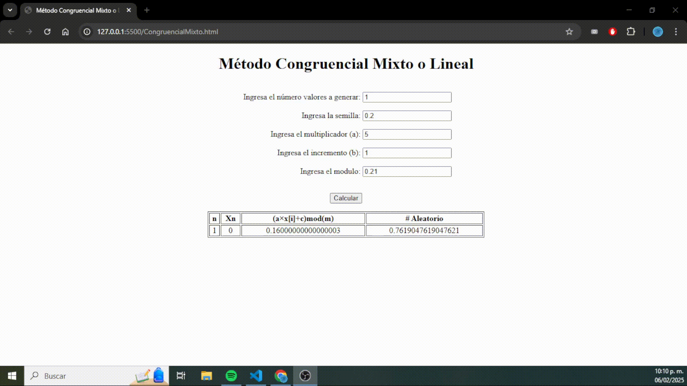

# Modelación y Simulación

### Contexto
La materia de Modelación y Simulación en Ingeniería de Software permite analizar, predecir y optimizar el comportamiento de sistemas antes de su implementación, ayudando en la toma de decisiones, la evaluación de rendimiento y la mejora de algoritmos o infraestructuras. Su aplicación abarca desde la simulación de procesos en software hasta el análisis de rendimiento en sistemas distribuidos, machine learning e ingeniería de software empírica, permitiendo reducir costos y minimizar riesgos mediante la experimentación en entornos virtuales antes de aplicar cambios en escenarios reales.

Todo este pequeño repositorio abarca el contenido desarrollado en la materia en la Ingeniería.

### Tecnologías
Todo el repositorio se encuentra en JS Vanilla, por lo que es muy sencillo clonar y probar el repositorio.

### Instalación 

1. Clona el repositorio: 
    
    **Importante: Esto se debe de realizar desde la carpeta de xampp de htdocs!!!**

    ```bash
    git clone https://github.com/AntonioNoguera/ModelingAndSimulation-E2023
    cd ModelingAndSimulation 

2. Ejecucción

    Podrías implementar LiveServer de VS Code, mediante este es sencillo ver el contenido ejecutado de los archivos.

## Funcionalidad 

En esta sección se incluyen los recursos visuales utilizados en este documento.

### 🎲 Generador Congrencial / Mixto

Este GIF muestra la implementación y evaluación de generadores de números aleatorios mediante métodos congruenciales y mixtos, fundamentales en simulaciones y modelos probabilísticos.

### 📊 Generadores de Números en Distribución (Uniforme/Normal/Poisson)

Ilustra la generación de números aleatorios con distribuciones específicas (Uniforme, Normal y Poisson), incluyendo la validación estadística de los datos generados.


### 🏗️ Modelo Final

Presenta la estructura final del modelo de simulación, mostrando su flujo de ejecución y validación.
Este va de la distribución de tiempos y cargas que las máquinas de autocobro en un soriana presentan, buscando encontrar una simulación de esta distribución para determinar si el número de máquinas es suficiente.

### ♠️ Prueba de Poker

Demuestra la aplicación de la prueba de poker, una técnica estadística utilizada para evaluar la aleatoriedad de un conjunto de números generados.

 
### Mejoras
- Uniformidad: La realidad es que el repositorio no se trabajo de una forma tan estandarizada, fue un reto coordinar los participantes, y por la falta de experiencia se puede observar un trabajo final un tanto inconsistente.